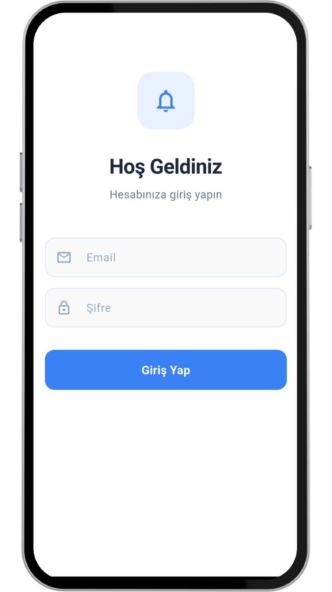
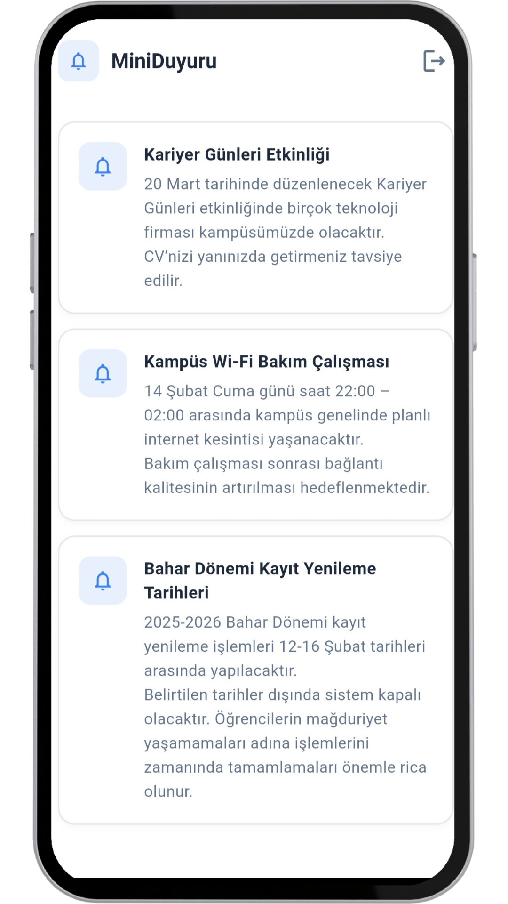
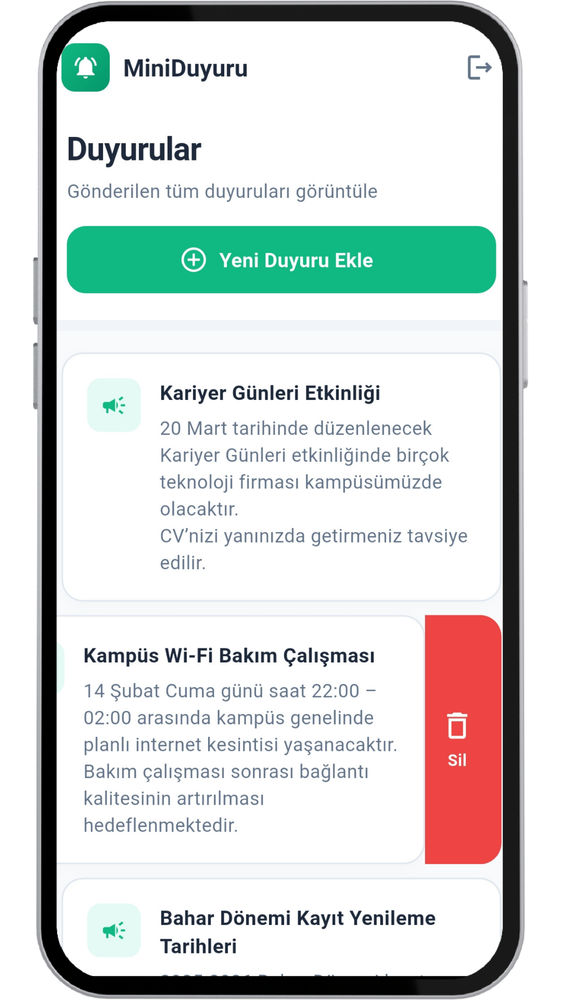
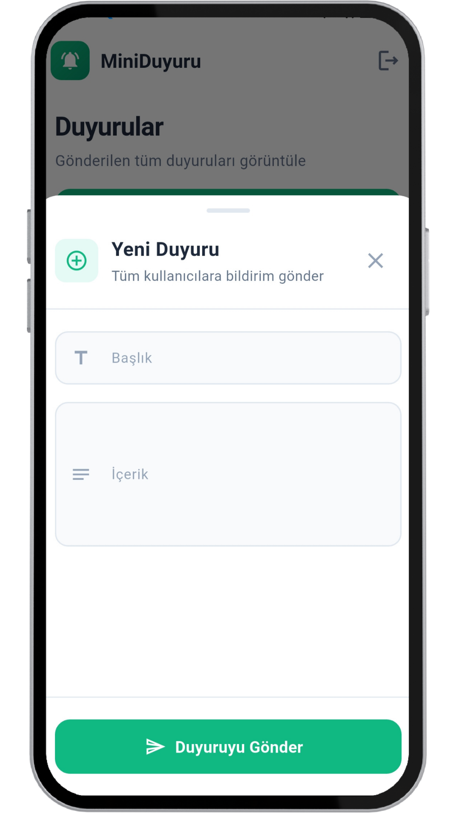
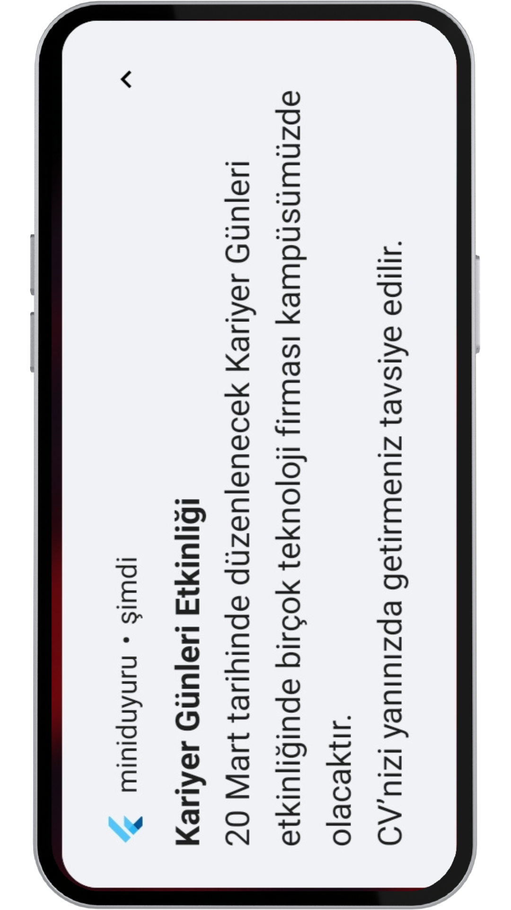

# 🚀 Mini Duyuru (Flutter + MVVM)

Mini Duyuru, admin tarafından oluşturulan duyuruların tüm kullanıcılara gerçek zamanlı olarak bildirim (push notification) şeklinde
iletilmesini sağlayan Flutter + Firebase tabanlı bir mobil uygulamadır.

---

## 📱 Projenin Amacı

- Admin kullanıcıların duyuru oluşturabilmesi
- Kullanıcıların duyuruları listeleyebilmesi
- Yeni duyuru eklendiğinde tüm kullanıcılara otomatik bildirim gitmesi
- Role-based (admin / user) kontrol mekanizması

---

## 🛠️ Kullanılan Teknolojiler

- Flutter
- Firebase Authentication
- Cloud Firestore
- Firebase Cloud Messaging (FCM)
- Cloud Functions (2nd Gen - Node.js 22)
- Provider (State Management)

---

## 🔐 Yetkilendirme Yapısı

- Uygulamada iki farklı rol bulunmaktadır:
  - Admin
    - Duyuru ekleyebilir
    - Duyuru silebilir
    - Eklenen duyurular otomatik olarak bildirim gönderir
  - User
    - Duyuruları listeleyebilir
    - Bildirim alır
    - Kullanıcı rolleri Firestore üzerinde users koleksiyonunda role alanı ile yönetilmektedir.

---

## 🔔 Bildirim Mekanizması

- Admin yeni duyuru ekler.
- Duyuru Firestore notifications koleksiyonuna kaydedilir.
- Cloud Function tetiklenir (onCreate).
- Function tüm kullanıcıların FCM tokenlarını alır.
- Push notification gönderilir.
Bu yapı sayesinde backend tarafında manuel işlem yapmadan otomatik bildirim akışı sağlanmaktadır.

---

## <h2>📸 Ekran Görüntüleri</h2>

  
  
  

  
  

