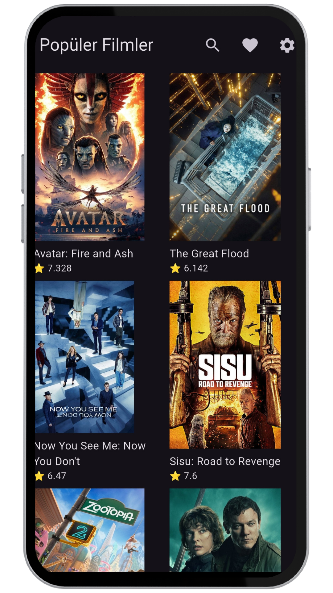
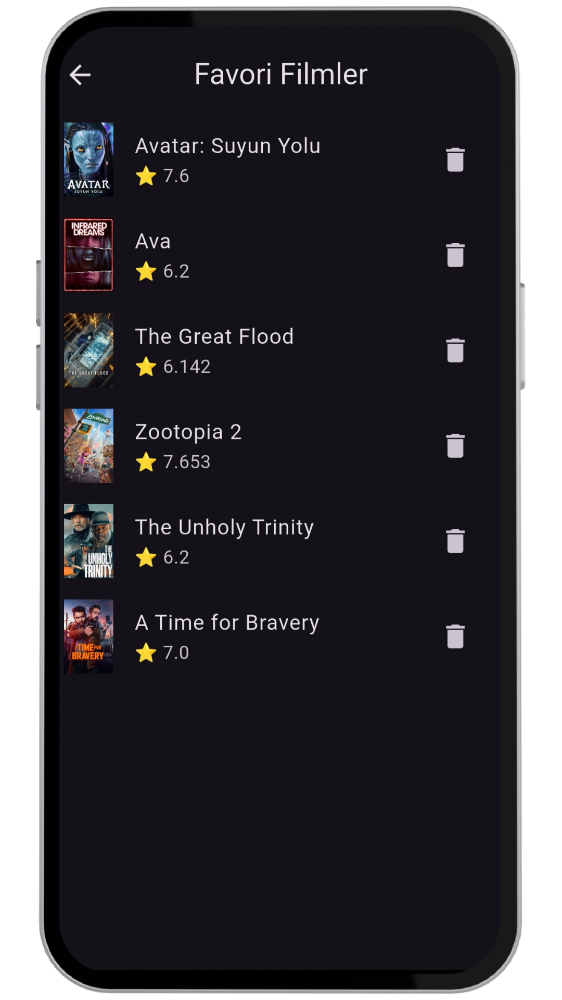
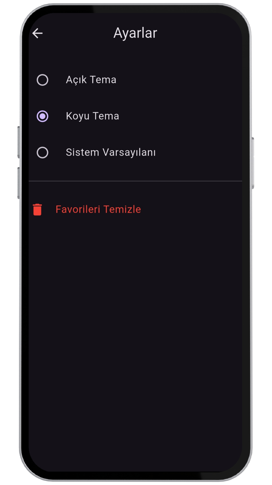

# 🎬 Movie App (Flutter + MVVM)

Bu proje, Flutter kullanılarak **MVVM mimarisi** ile geliştirilmiş bir film uygulamasıdır.  
TMDB API üzerinden film verileri çekilir, kullanıcılar favori filmlerini yönetebilir ve
uygulama ayarlarını özelleştirebilir.

---

## 🚀 Özellikler

- Popüler filmleri listeleme
- Film arama (Search)
- Film detay sayfası
- Favorilere ekleme / çıkarma
- Tema değiştirme (Light / Dark / System)
- Ayarlar ekranı
- MVVM mimarisi
- Provider ile state management

---

## 🧱 Mimari

Proje **MVVM (Model - View - ViewModel)** mimarisine uygun olarak yapılandırılmıştır.

- **Model**: Film veri modelleri
- **View**: UI ekranları
- **ViewModel**: İş mantığı ve state yönetimi

---

## 🛠 Kullanılan Teknolojiler

- Flutter
- Provider
- HTTP
- Shared Preferences
- TMDB API

---

## <h2>📸 Ekran Görüntüleri</h2>

  
  
  

  
  

