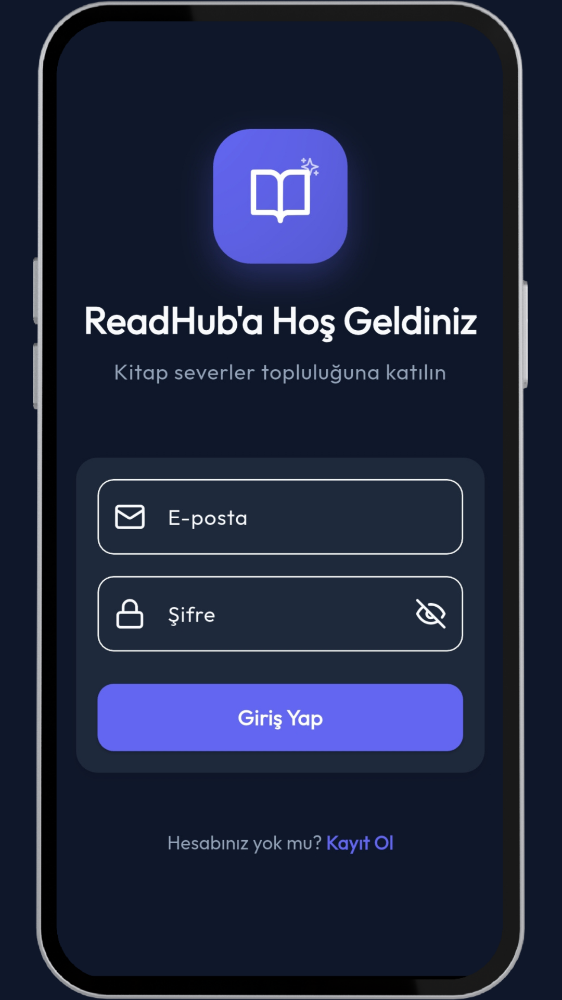
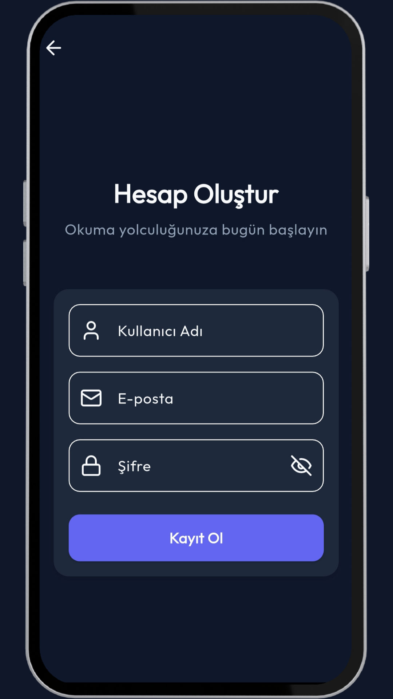
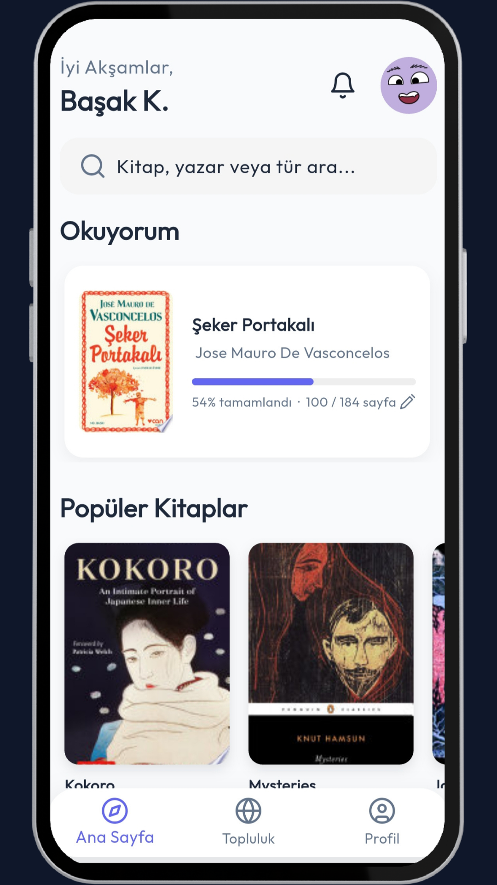
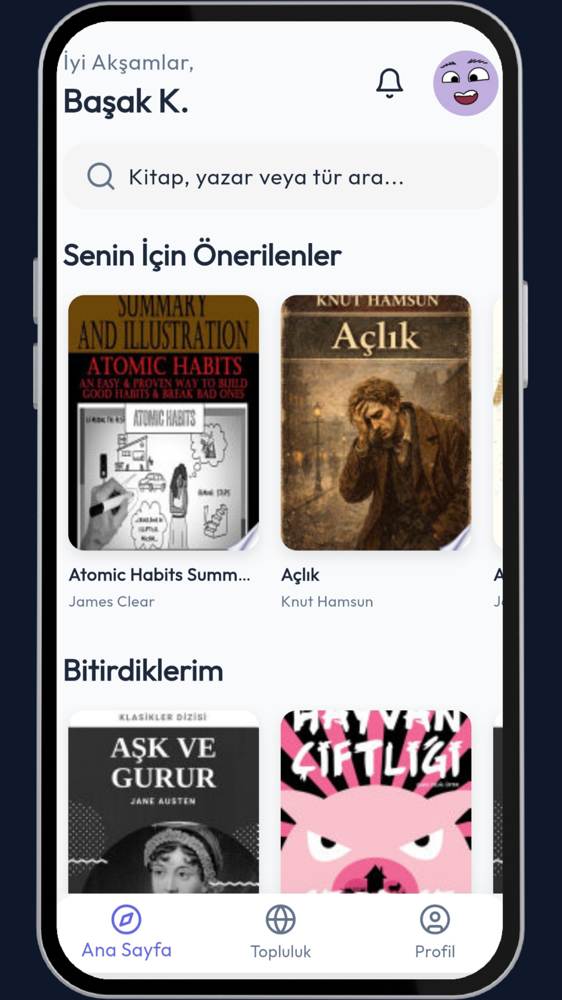
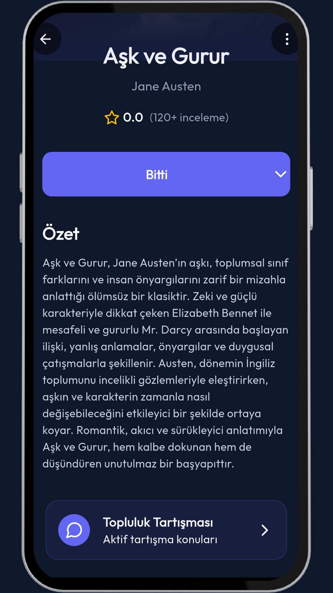
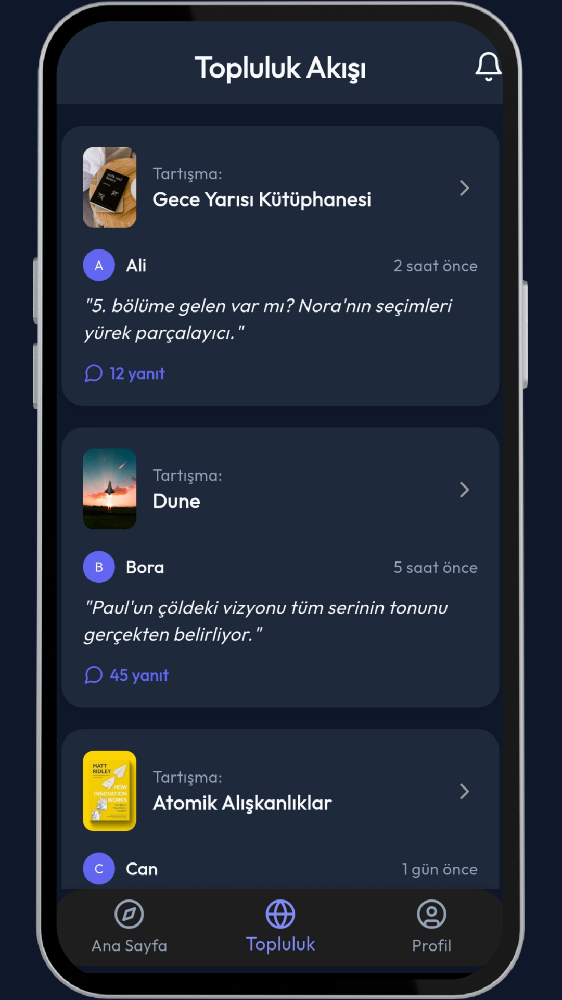
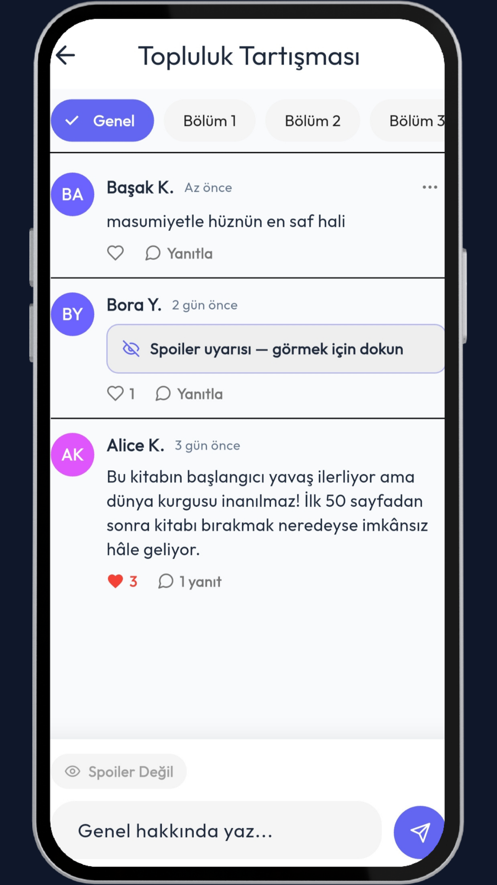
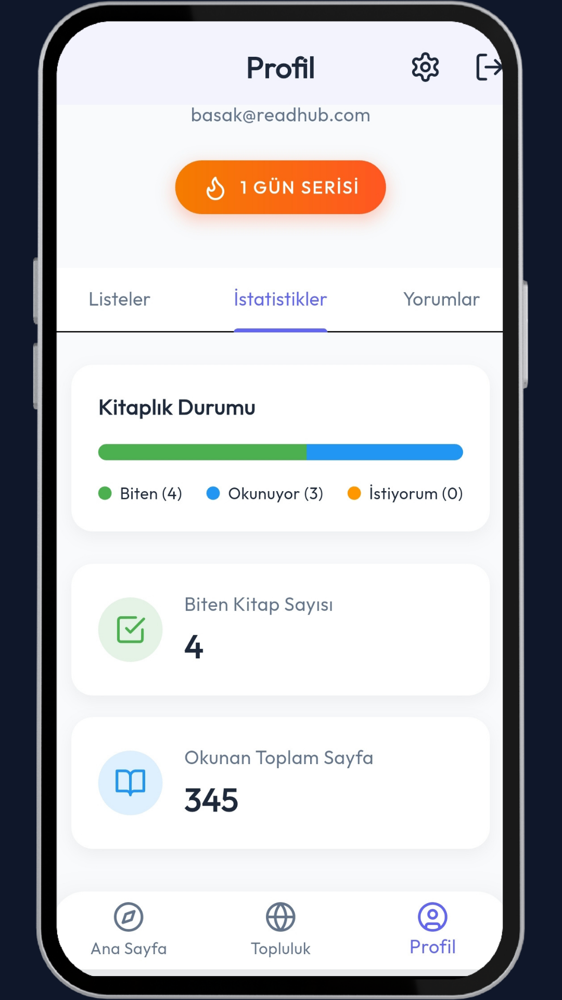
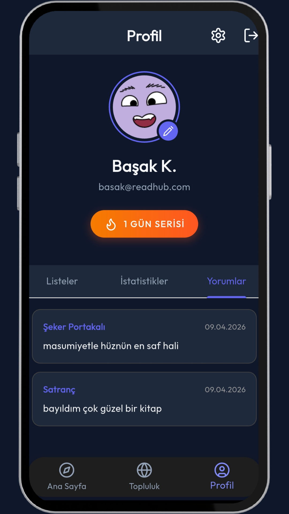
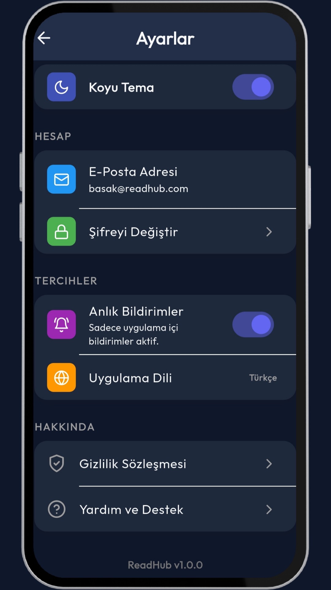

<div align="center">

# 📚 ReadHub

**Kitap severlerin buluşma noktası — okuma takibi, topluluk tartışmaları ve kişiselleştirilmiş öneriler.**

[](https://flutter.dev)
[](https://dart.dev)
[](https://firebase.google.com)
[](LICENSE)

</div>

---

## 🌟 Uygulama Hakkında

**ReadHub**, Flutter ile geliştirilmiş, Firebase altyapısı üzerine inşa edilmiş modern bir kitap takip ve topluluk uygulamasıdır. Kullanıcılar kitap arayabilir, okuma durumlarını takip edebilir, diğer okuyucularla spoilerli veya spoilersiz yorumlar paylaşabilir ve kişiselleştirilmiş kitap önerileri alabilir.

---

## ✨ Özellikler

### 🏠 Ana Sayfa (Home)
- **Şu an Okunanlar:** Okuma durumu "Okuyorum" olarak işaretlenen kitaplar anlık olarak listelenir.
- **Kişiselleştirilmiş Öneriler:** Okuduğunuz yazarlara ve kategorilere göre dinamik kitap önerileri.
- **Popüler Kitaplar:** Genel popülerlik sıralamasına göre kitap listesi.
- **Canlı Senkronizasyon:** Firestore Stream ile veriler sayfa yenilenmeden anlık güncellenir.

### 🔍 Kitap Arama
- **Google Books API** entegrasyonu ile milyonlarca kitap arasında arama.
- Kitap kapağı, yazar, puan ve açıklama bilgileri.
- Anlık arama sonuçları, shimmer yüklenme animasyonları.

### 📖 Kitap Detayı
- Kitap kapağı, başlık, yazar, puan, sayfa sayısı ve açıklama.
- **Okuma Durumu Takibi:**
  - 📌 Okumak İstiyorum
  - 📖 Okuyorum
  - ✅ Bitti
- Topluluk tartışmalarına hızlı erişim butonu.
- Okuma durumu değiştiğinde Ana Sayfa **anında** güncellenir.

### 💬 Topluluk (Community)
- Kitap bazlı tartışma odaları — Her kitabın kendi topluluk sayfası vardır.
- **Bölüm bazlı yorumlar:** Genel, Bölüm 1, Bölüm 2, Bölüm 3, Son Değerlendirme.
- **Spoiler koruması:** Spoilerli yorumlar otomatik olarak gizlenir, kullanıcı görmek istediğinde açar.
- **Yanıtlar (Replies):** Yorumların altına yanıt yazabilme.
- **Beğeni sistemi:** Yorum ve yanıtları beğenebilme (dolu kırmızı kalp animasyonu).
- **Bildirimler:** Yorumunuz beğenildiğinde veya yanıtlandığında bildirim alırsınız.
- Canlı topluluk akışı (Aktif tartışmalar listesi).

### 👤 Profil
- Kullanıcı adı ve profil fotoğrafı.
- **Okuma İstatistikleri:** Tamamlanan kitap sayısı, okunan toplam sayfa.
- **Kitaplık sekmeleri:** Okuyorum / Tamamladım / Okumak İstiyorum.
- **Yorumlarım:** Tüm kitaplara yapılan yorumlar tek bir akışta, anlık güncelleme ile.
- Profil fotoğrafı güncellendiğinde Ana Sayfa dahil tüm ekranlar anında yansır.
- Değişken avatar sistemi (harf baş harfleri ile renk kodlu avatarlar).

### 🔔 Bildirimler
- Yorum beğeni bildirimleri.
- Yanıt bildirimleri.
- Bildirim geçmişi ekranı.

### ⚙️ Ayarlar
- **Karanlık / Aydınlık mod** geçişi.
- Hesap bilgilerini düzenleme.
- Çıkış yapma.

### 🔐 Kimlik Doğrulama
- E-posta ve şifre ile **Kayıt & Giriş**.
- Firebase Authentication entegrasyonu.

---

## 🏗️ Mimari & Teknoloji

### Teknoloji Yığını

| Katman | Teknoloji |
|---|---|
| **Framework** | Flutter 3.x + Dart 3.x |
| **State Management** | Provider + ChangeNotifier |
| **Navigasyon** | GoRouter |
| **Backend** | Firebase (Firestore, Auth) |
| **Kitap API** | Google Books API |
| **UI Kütüphaneleri** | Lucide Icons, Google Fonts, Shimmer |
| **Yerel Depolama** | Shared Preferences |

### Proje Yapısı

```
lib/
├── core/
│   ├── routing/         # GoRouter navigasyon
│   ├── theme/           # AppTheme, AppColors
│   └── widgets/         # Paylaşılan widget'lar (BottomNav, BookCover vb.)
│
└── features/
    ├── auth/            # Giriş & Kayıt ekranları + ViewModel
    ├── home/            # Ana sayfa, arama, kitap repository
    ├── book_detail/     # Kitap detay + okuma durumu
    ├── community/       # Topluluk tartışmaları, yorumlar, beğeniler
    └── profile/         # Profil, bildirimler, ayarlar
```

### Veri Mimarisi (Firestore)

```
users/
  {uid}/
    reading_states/   → Okuma durumu kayıtları
    my_comments/      → Anlık profil sync için yorumlar (denormalize)

books/
  {bookId}/
    comments/
      {commentId}/
        replies/      → Yoruma yanıtlar
```

### Anlık Senkronizasyon (Reactive)

- **Ana Sayfa:** `reading_states` koleksiyonu stream ile dinlenir → durum değişince sayfa otomatik güncellenir.
- **Profil Yorumları:** `my_comments` koleksiyonu stream ile dinlenir → yorum yapılınca profil anında güncellenir.
- **Topluluk:** Yorumlar ve yanıtlar stream ile canlı aktarılır.

---


## 📄 Lisans

Bu proje [MIT Lisansı](LICENSE) kapsamında lisanslanmıştır.

---

## 📱 Ekran Görüntüleri

<p align="center">
  
  
  
  
</p>

<p align="center">
  
  
  
  
</p>

<p align="center">
  
  
  
  
</p>

---

<div align="center">
  <b>ReadHub</b> — Kitaplarla dolu bir dünya 📖
</div>
