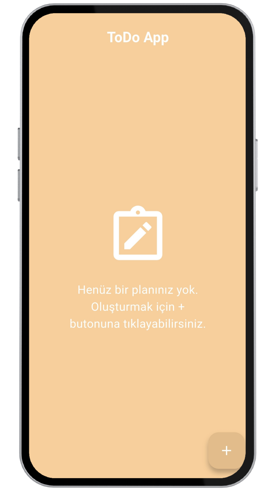
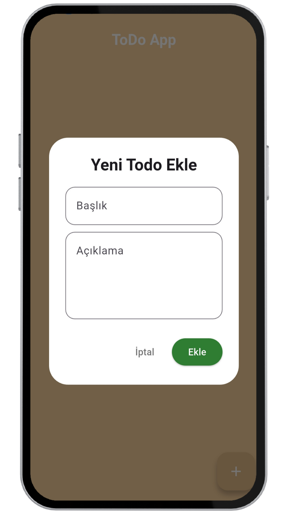
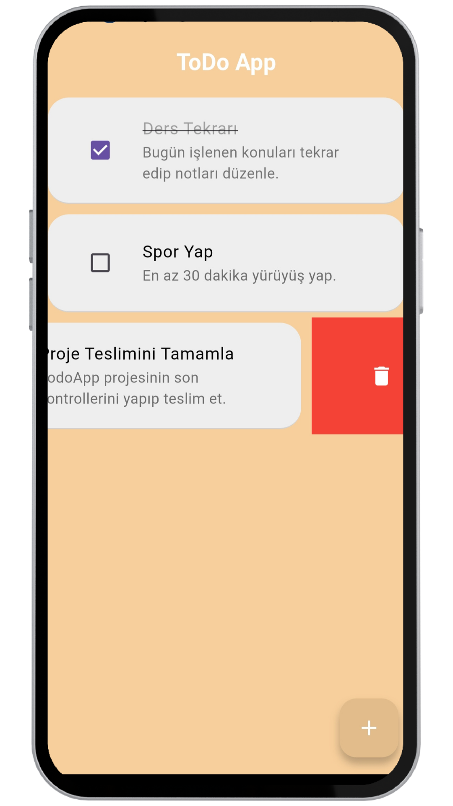

# todoapp
<h1 align="center">📝 Todo App (Flutter + MVVM)</h1>

  Bu proje, Flutter kullanılarak geliştirilmiş, MVVM (Model–View–ViewModel) mimarisini temel alan basit ama öğretici bir Todo uygulamasıdır. Projenin ana amacı; temiz mimari, state management, test yazımı ve UI–logic ayrımı konularını pratik ederek öğrenmektir.

---

<h2>🎯 Projenin Amacı</h2>

- Flutter'da MVVM mimarisini doğru şekilde uygulamak
- UI (View) ile iş mantığını (ViewModel) ayırmak
- provider paketi ile state management yapmak
- ViewModel için unit test yazmak

---

<h2>🏗️ Kullanılan Mimari: MVVMr</h2>

MVVM Katmanları
- Model
Uygulamada kullanılan veri yapısını temsil eder.
Örnek: ToDoModel

- View
Sadece UI'dan sorumludur. State tutmaz, iş mantığı içermez.
Örnek: ToDoView, AddTodoDialog

- ViewModel
Uygulamanın iş mantığını ve state’ini yönetir.
UI, ViewModel’i Provider üzerinden dinler.
Örnek: TodoViewModel

Bu yapı sayesinde:
- Kod daha okunabilir olur
- Test yazmak kolaylaşır
- UI değişiklikleri iş mantığını etkilemez
---

<h2>📸 Ekran Görüntüleri</h2>

  
  
  

---

<h2>👨‍💻 Not</h2>
Bu proje, öğrenme ve mimari pratiği amacıyla geliştirilmiştir.
Basit tutulmuş ancak doğru yazılmaya odaklanılmıştır.

