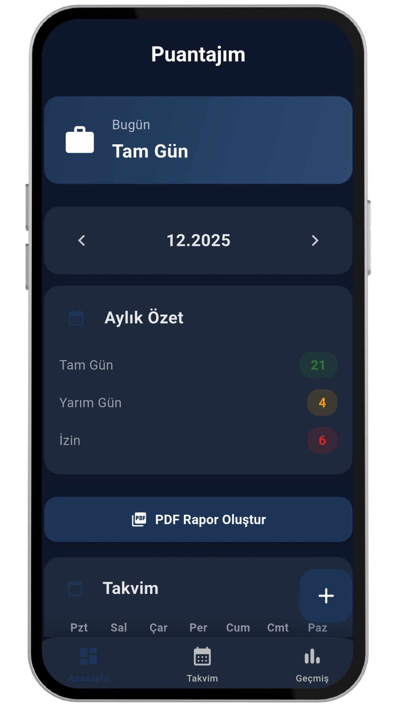
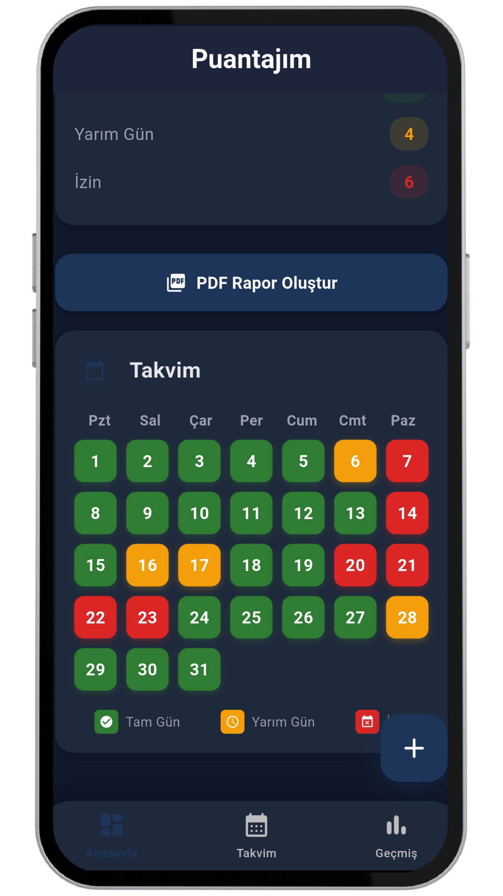
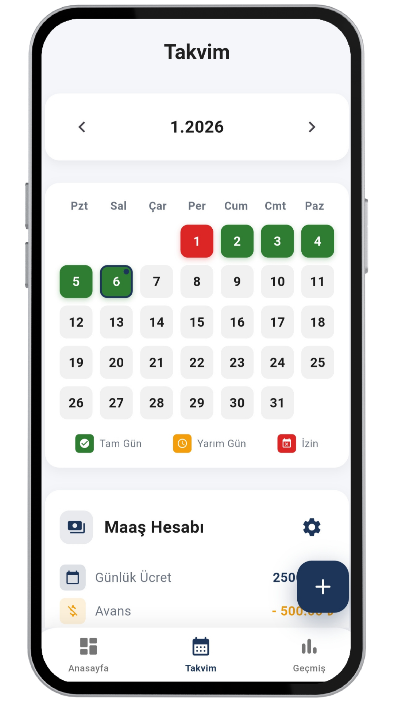
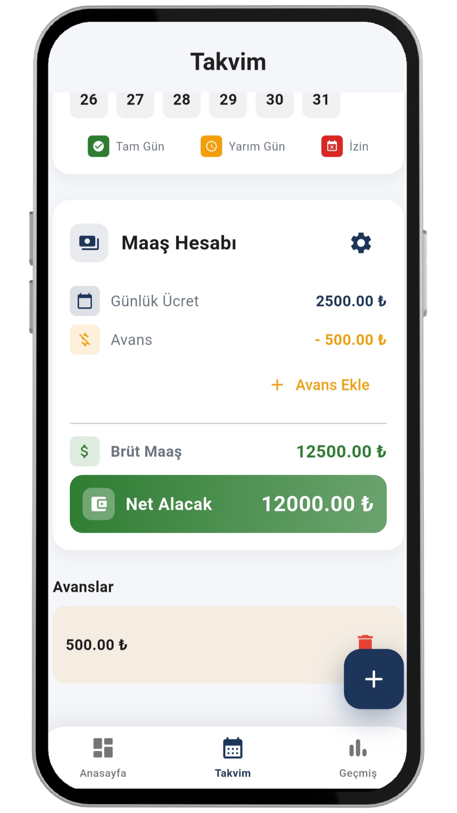
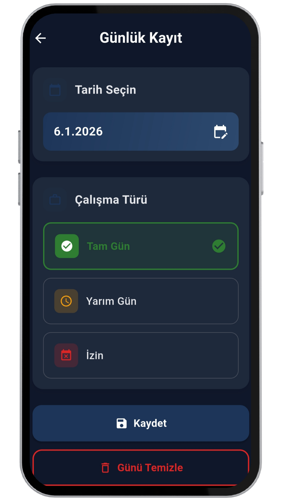
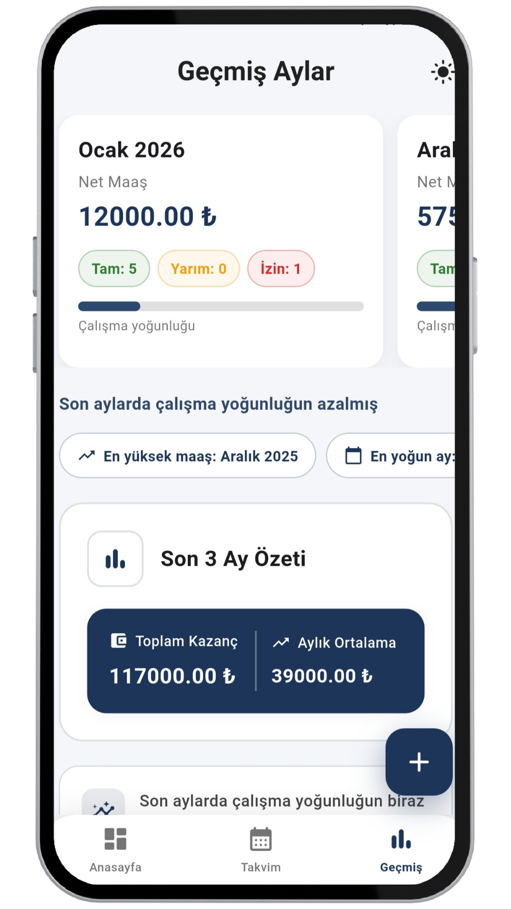
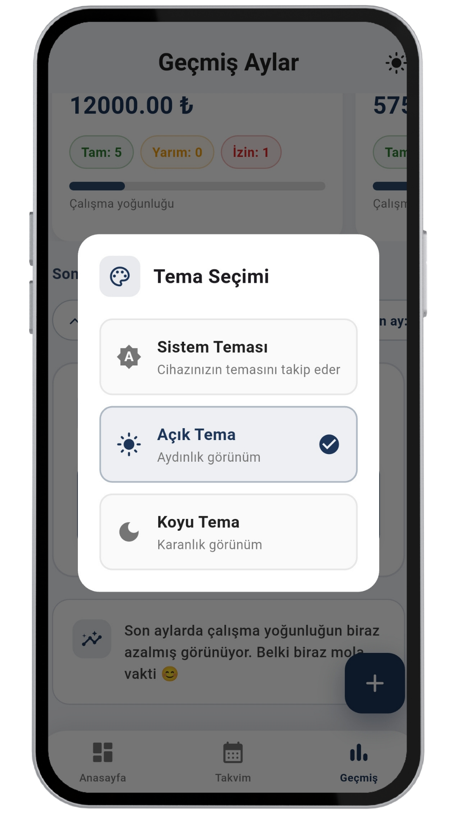

# 🗓️ WorkdayApp 

**WorkdayApp**, çalışanların günlük çalışma durumlarını, izinlerini, avanslarını ve maaş hesaplamalarını
kolayca takip edebileceği Flutter ile geliştirilmiş bir mobil uygulamadır.
Uygulama, modern UI tasarımı ve MVVM mimarisi ile geliştirilmiştir.

---

## 🚀 Özellikler

##  📌 Günlük Çalışma Takibi
- Tam gün / Yarım gün / İzin girişi
- Takvim üzerinden günlük durum görüntüleme
- Çalışma skoruna göre yoğunluk hesaplama

## 💰 Maaş Hesaplama
- Günlük çalışma durumuna göre net maaş hesaplama
- Ay bazlı maaş detayları
- Son 3 ayın karşılaştırmalı analizi

##  📊 Geçmiş Aylar & İstatistikler
- Son 3 ayı yatay kaydırmalı kartlar ile görüntüleme
- Aylık:
  - Net maaş
  - Tam / Yarım / İzin gün sayıları
  - Çalışma yoğunluğu progress bar
- En yoğun ay & en yüksek maaş alınan ay bilgisi
- Son 3 ay için:
  - Toplam kazanç
  - Aylık ortalama kazanç
  - Dinamik özet cümlesi (trend analizi)

##  💸 Avans Takibi
- Alınan avansların listelenmesi
- Ay bazlı avans geçmişi
- Maaş hesaplamasına avansların dahil edilmesi

 ##  🎨 Tema Desteği
 - Açık Tema
 - Koyu Tema
 - Sistem temasını otomatik takip etme

---

## 🧱 Mimari
Proje MVVM (Model – View – ViewModel) mimarisine uygun olarak yapılandırılmıştır.
 ## Model
   - Uygulamada kullanılan veri modellerini temsil eder.
   - Çalışma günü, maaş, avans ve ay bazlı verilerin yapısını içerir.

## View
  - Kullanıcı arayüzünü oluşturan ekranlardır.
  - UI yalnızca ViewModel’den gelen verileri dinler ve gösterir.

## ViewModel
  - İş mantığını ve state yönetimini içerir.
  - Çalışma skorları, maaş hesaplamaları, istatistikler ve tema yönetimi burada yapılır.

Bu yapı sayesinde:
- Kod okunabilirliği artar
- UI ile iş mantığı birbirinden ayrılır
- Test edilebilir ve sürdürülebilir bir yapı elde edilir

---

## 🛠 Kullanılan Teknolojiler

- Flutter
- Provider
- Shared Preferences

---

## <h2>📸 Ekran Görüntüleri</h2>

  
  
  
  

  
  
  

---
## 🚀 Gelecekte Eklenecek Özellikler

- 🔐 Giriş & Yetkilendirme Sistemi
  - Yönetici ve Çalışan rolleri
  - Rol bazlı ekran ve yetki ayrımı
- 👤 Yönetici Paneli
  - Çalışan ekleme / çıkarma
  - Aylık çalışma ve maaş verilerini görüntüleme
  - Genel istatistik ve raporlar
- 🧑‍💼 Çalışan Paneli
  - Kendi çalışma geçmişini detaylı inceleme
  - Avans talep etme ve geçmişini görüntüleme
  - Aylık performans ve maaş özetleri
- 🔔 Bildirim Sistemi
  - Maaş hesaplandı bildirimi
  - Avans onay / reddedilme bildirimleri
  - Aylık özet hatırlatmaları
---

